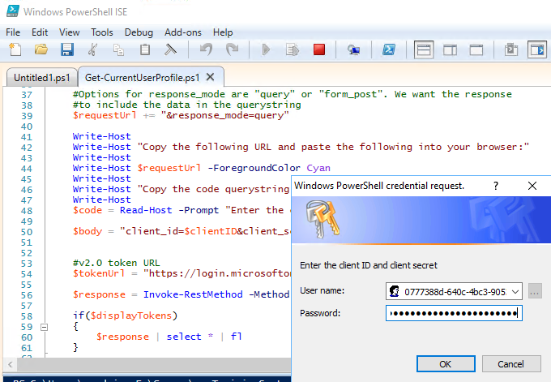

# Obtain tokens and connect with the Microsoft Graph using REST

This demo will walk you through connecting to the Azure AD v2.0 endpoints to authorize the application, obtain a token and connect with Microsoft Graph.

## Register the application for getting tokens using REST

1. Open a browser and navigate to the [Azure Active Directory admin center](https://aad.portal.azure.com). Login using a **personal account** (aka: Microsoft Account) or **Work or School Account**.

1. Select **Azure Active Directory** in the left-hand navigation, then select **App registrations** under **Manage**.

1. Select **New registration**. On the **Register an application** page, set the values as follows.

    - Set **Name** to `Graph Authentication Test`.
    - Set **Supported account types** to **Accounts in any organizational directory and personal Microsoft accounts**.
    - Under **Redirect URI**, set the first drop-down to `Web` and set the value to `https://localhost:44326`.

1. Choose **Register**. On the **Graph Authentication Test** page, copy the value of the **Application (client) ID** and save it, you will need it in the next step.

1. Select **Certificates & secrets** under **Manage**. Select the **New client secret** button. Set  **Description** to `Never expires`, set **Expires** to `Never` and choose **Add**.

    

1. Copy the client secret value before you leave this page. You will need it in the next step.

    > **Important:** This client secret is never shown again, so make sure you copy it now.

1. Select **Authentication** under **Manage**. Check `ID tokens` under **Implicit grant** in the **Advanced settings** section and choose **Save**. This setting indicates that you want to get an ID token along with the access and refresh tokens. You'll see this later in the exercise.

    

## Create the PowerShell script

1. Open a new **PowerShell ISE** window. Copy the following code and paste in the script pane. 

    ```powershell
    function Get-CurrentUserProfile
    {
      Param
      (
        [parameter(Mandatory=$true,
        ValueFromPipeline=$true)]
        [PSCredential]
        $credential,
        [parameter(Mandatory=$true)]
        [string]
        $scopes,
        [parameter(Mandatory=$true)]
        [string]
        $redirectUrl,
        [switch]
        $displayTokens
      )

      $clientID = $credential.Username
      $clientSecret = $credential.GetNetworkCredential().Password
      #URL encode the secret
      $clientSecret = [System.Web.HttpUtility]::UrlEncode($clientSecret)

      #v2.0 authorize URL
      $authorizeUrl = "https://login.microsoftonline.com/common/oauth2/v2.0/authorize"

      #Permission scopes
      $requestUrl = $authorizeUrl + "?scope=$scopes"

      #Code grant, will receive a code that can be redeemed for a token
      $requestUrl += "&response_type=code"

      #Add your app's Application ID
      $requestUrl += "&client_id=$clientID"

      #Add your app's redirect URL
      $requestUrl += "&redirect_uri=$redirectUrl"

      #Options for response_mode are "query" or "form_post". We want the response
      #to include the data in the querystring
      $requestUrl += "&response_mode=query"

      Write-Host
      Write-Host "Copy the following URL and paste the following into your browser:"
      Write-Host
      Write-Host $requestUrl -ForegroundColor Cyan
      Write-Host
      Write-Host "Copy the code querystring value from the browser and paste it below."
      Write-Host
      $code = Read-Host -Prompt "Enter the code"

      $body = "client_id=$clientID&client_secret=$clientSecret&scope=$scopes&grant_type=authorization_code&code=$code&redirect_uri=$redirectUrl"
      #v2.0 token URL
      $tokenUrl = "https://login.microsoftonline.com/common/oauth2/v2.0/token"

      $response = Invoke-RestMethod -Method Post -Uri $tokenUrl -Headers @{"Content-Type" = "application/x-www-form-urlencoded"} -Body $body

      if($displayTokens)
      {
        $response | select * | fl
      }

      #Pass the access_token in the Authorization header to the Microsoft Graph
      $token = $response.access_token
      Invoke-RestMethod -Method Get -Uri "https://graph.microsoft.com/v1.0/me" -Headers @{"Authorization" = "bearer $token"}
    }

    Add-Type -AssemblyName System.Web

    #offline_access:  Allows requesting refresh tokens
    #openid:  Allows your app to sign the user in and receive an app-specific identifier for the user
    #profile: Allows your app access to all other basic information such as name, preferred username, object ID, and others
    #User.Read: Allows your app to read the current's user's profile
    $scopes = "offline_access+openid+profile+User.Read"

    #Redirects to this URL will show a 404 in your browser, but allows you to copy the returned code from the URL bar
    #Must match a redirect URL for your registered application
    $redirectURL = "https://localhost:44326"

    $credential = Get-Credential -Message "Enter the client ID and client secret"
    Get-CurrentUserProfile $credential -scopes $scopes -redirectUrl $redirectURL -displayTokens
    ```

    >Note:  This script will first create an URL to the authorize endpoint, providing the client ID, permission scopes, and redirect URL. If you attempted to use Invoke-RestMethod to this endpoint, the result would be the HTML content of the resulting login screen. You need to log in and authorize the application, so you will copy the URL to a browser.

1. Run the PowerShell script. You are prompted to enter a username and password. The username is the application ID and the password is the client secret that you saved in previous steps.

    

1. Copy the resulting URL.

    

1. Paste the URL in a browser and sign in when prompted. After you sign in and authorize the application, the browser will be redirected to the redirect URL we configured earlier (https://localhost:44326). There's nothing listening at that URL but that doesn't matter since all we need now is the value of the code `querystring` parameter.

    

1. Copy the code value from the `querystring` in the browser's URL bar, up to the trailing `&session_state` querystring value.

    

1. Paste the code value into the PowerShell window. The result is a successful call to Microsoft Graph, getting the profile of the currently signed-in user.

    

    

    >Note:  The output includes three tokens: an ID token, an access token, and a refresh token. These tokens are JWT tokens that, as of the time of this writing, can be decoded and their contents inspected. These tokens are currently not encrypted but that is subject to change.

1. Copy the `access_token` value in the output.

    

1. Open a browser and go to **https://jwt.ms**.

1. Paste the encoded token (removing any whitespace) to inspect its contents.

    