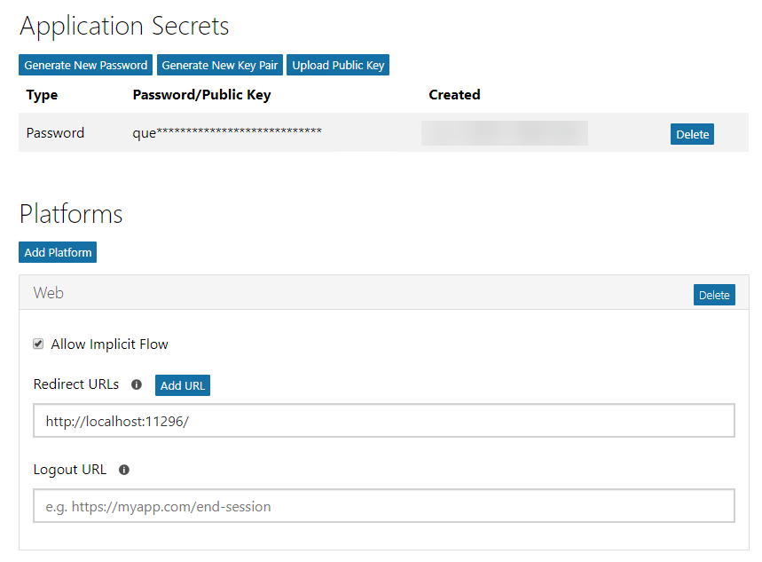
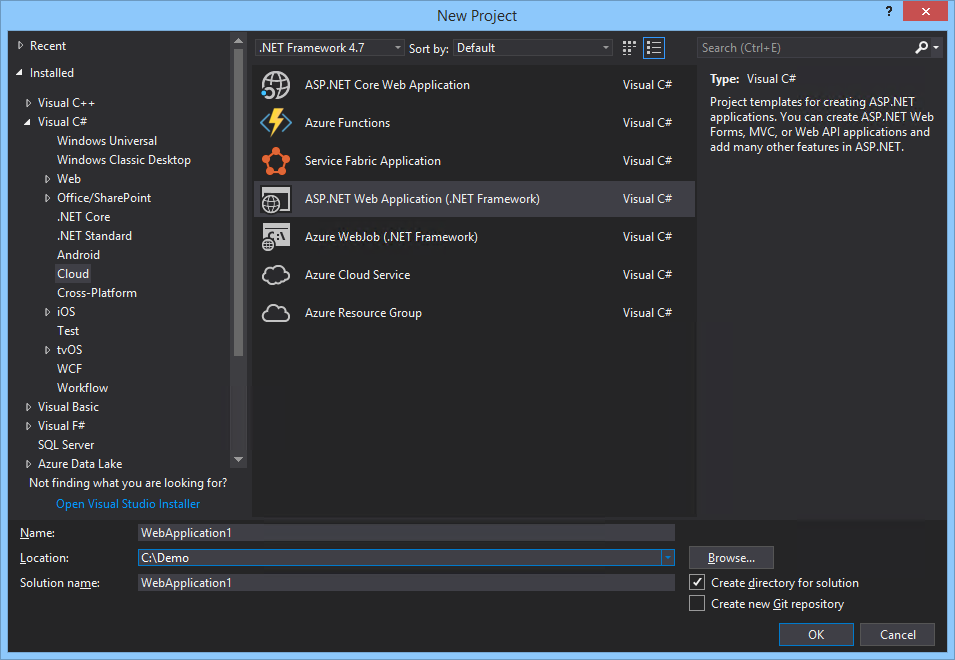

# Obtain tokens and connect with the Microsoft Graph using REST

This demo will walk you through connecting to the Azure AD v2.0 endpoints to authorize the application, obtain a token and connect with Microsoft Graph.

## Register the application

1. Visit the [Application Registration Portal](https://apps.dev.microsoft.com/) to register the application.

1. Once the application is created, an app ID is provided on the screen. Copy this app ID as you will use it as the Client ID.

1. Add a new app secret by selecting the **Generate new password** button and copy the app secret to use later as the client secret.

1. Select the **Add Platform** button. In the dialog box, choose **Web Application**. Change the Redirect URL to **http://localhost:8089**. Select **Save**.

    

1. Open **Visual Studio 2017** and create a new **ASP.NET Web Application (.NET Framework)**.

    

1. Choose **MVC**.

    

1. Copy the URL of the MVC app for use in the following script. Start the debugger.

    

1. Open a new **PowerShell ISE** window. Copy the following code and paste in the script pane. Replace `[YOUR WEB APP URL]` in the third to last line with the URL of the web application you created in the previous step.

    ```powershell
    function Get-CurrentUserProfile
    {
        Param
        (
            [parameter(Mandatory=$true,
            ValueFromPipeline=$true)]
            [PSCredential]
            $credential,
            [parameter(Mandatory=$true)]
            [string]
            $scopes,
            [parameter(Mandatory=$true)]
            [string]
            $redirecUrl,
            [switch]
            $displayTokens
        )

        $clientID = $credential.Username
        $clientSecret = $credential.GetNetworkCredential().Password

        #v2.0 authorize URL
        $authorizeUrl = "https://login.microsoftonline.com/common/oauth2/v2.0/authorize"

        #Permission scopes
        $requestUrl = $authorizeUrl + "?scope=$scopes"

        #Code grant, will receive a code that can be redeemed for a token
        $requestUrl += "&response_type=code"

        #Add your app's Application ID
        $requestUrl += "&client_id=$clientID"

        #Add your app's redirect URL
        $requestUrl += "&redirect_uri=$redirecUrl"

        #Options for response_mode are "query" or "form_post". We want the response
        #to include the data in the querystring
        $requestUrl += "&response_mode=query"

        Write-Host
        Write-Host "Copy the following URL and paste the following into your browser:"
        Write-Host
        Write-Host $requestUrl -ForegroundColor Cyan
        Write-Host
        Write-Host "Copy the code querystring value from the browser and paste it below."
        Write-Host
        $code = Read-Host -Prompt "Enter the code"

        $body = "client_id=$clientID&client_secret=$clientSecret&scope=$scopes&grant_type=authorization_code&code=$code&redirect_uri=$redirecUrl"
        #v2.0 token URL
        $tokenUrl = "https://login.microsoftonline.com/common/oauth2/v2.0/token"

        $response = Invoke-RestMethod -Method Post -Uri $tokenUrl -Headers @{"Content-Type" = "application/x-www-form-urlencoded"} -Body $body

        if($displayTokens)
        {
            $response | select * | fl
        }

        #Pass the access_token in the Authorization header to the Microsoft Graph
        $token = $response.access_token
        Invoke-RestMethod -Method Get -Uri "https://graph.microsoft.com/v1.0/me" -Headers @{"Authorization" = "bearer $token"}
    }

    #offline_acess:  Allows requesting refresh tokens
    #openid:  Allows your app to sign the user in and receive an app-specific identifier for the user
    #profile: Allows your app access to all other basic information such as name, preferred username, object ID, and others
    #User.Read: Allows your app to read the current's user's profile
    $scopes = "offline_access+openid+profile+User.Read"

    #Redirects to this URL will show a 404 in your browser, but allows you to copy the returned code from the URL bar
    #Must match a redirect URL for your registered application
    $redirectURL = "[YOUR WEB APP URL]"

    $credential = Get-Credential -Message "Enter the client ID and client secret"
    Get-CurrentUserProfile $credential -scopes $scopes -redirecUrl $redirectURL -displayTokens
    ```

    >Note:  This script will first create an URL to the authorize endpoint, providing the client ID, permission scopes, and redirect URL. If you attempted to use Invoke-RestMethod to this endpoint, the result would be the HTML content of the resulting login screen. You need to log in and authorize the application, so you will copy the URL to a browser.

1. Run the PowerShell script. You are prompted to enter a username and password. The username is the app ID generated when you registered the application. The password is the app secret that was generated.

    

1. Copy the resulting URL.

    

1. Paste the URL in a browser and sign in when prompted. After you sign in an authorize the application, the browser is redirected to the MVC app you have running, the URL contains the code needed.

    

1. Copy the code value from the `querystring` in the browser's URL bar, up to the trailing `&session_state` querystring value.

    

1. Paste the code value into the PowerShell window. The result is a successful call to Microsoft Graph, getting the profile of the currently signed-in user.

    

    

    >Note:  The output includes three tokens: an ID token, an access token, and a refresh token. These tokens are JWT tokens that, as of the time of this writing, can be decoded and their contents inspected. These tokens are currently not encrypted but that is subject to change.

1. Copy the `access_token` value in the output.

    

1. Open a browser and go to **https://jwt.calebb.net**.

1. Paste the encoded token to inspect its contents.

    