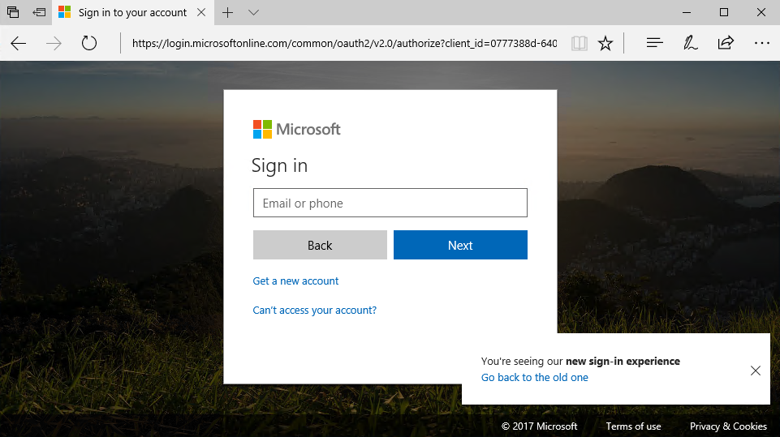

# Connecting with Microsoft Graph using OpenID Connect

This demo will walk you through creating a web application that connects with Microsoft Graph using OpenID Connect.

## Requirements

- Visual Studio 2017
- A personal Microsoft Account with access to an Outlook.com enabled mailbox
- A work or school account with access to an Office 365 enabled mailbox

## Register the application for OpenID Connect

**Note:** You can reuse the same application registration from the previous lab, [Obtain tokens and connect with the Microsoft Graph using REST](../01-rest-via-powershell/readme.md). If you have already completed the app registration, move to the next section.

1. If you are not reusing your previously created application registration, follow the steps in [Register the application for getting tokens using REST](../01-rest-via-powershell/readme.md#register-the-application-for-getting-tokens-using-rest).

1. From your shell or command line, paste the following:

    ```shell
    git clone https://github.com/Azure-Samples/active-directory-dotnet-webapp-openidconnect-v2.git
    ```

1. Open the solution using **Visual Studio 2017**. Restore the missing NuGet packages and reload the solution.

1. Edit the **web.config** file with your app's coordinates. Find the appSettings key `ida:ClientId` and provide the app ID from your app registration. Find the appSettings key `ida:ClientSecret` and provide the value from the app secret generated in the previous step.

## Inspect the code sample for OpenID Connect

1. Open the **App_Start/Startup.Auth.cs** file. This is where authentication begins using the OWIN middleware.

1. Verify that the `Scope` variable in your code is equal to `AuthenticationConfig.BasicSignInScopes + " email Mail.Read"`. Change it if needed. `AuthenticationConfig.BasicSignInScopes` has been set to `openid profile offline_access` elsewhere in the application so the scopes you will be requesting are `openid profile offline_access email Mail.Read`.

    ```csharp
    app.UseOpenIdConnectAuthentication(
        new OpenIdConnectAuthenticationOptions
        {
            // The `Authority` represents the v2.0 endpoint - https://login.microsoftonline.com/common/v2.0
            Authority = AuthenticationConfig.Authority,
            ClientId = AuthenticationConfig.ClientId,
            RedirectUri = AuthenticationConfig.RedirectUri,
            PostLogoutRedirectUri = AuthenticationConfig.RedirectUri,
            Scope = AuthenticationConfig.BasicSignInScopes + " email Mail.Read", // a basic set of permissions for user sign in & profile access "openid profile offline_access"
            TokenValidationParameters = new TokenValidationParameters
            {
                ValidateIssuer = false,
                // In a real application you would use IssuerValidator for additional checks, like making sure the user's organization has signed up for your app.
                //     IssuerValidator = (issuer, token, tvp) =>
                //     {
                //        //if(MyCustomTenantValidation(issuer))
                //        return issuer;
                //        //else
                //        //    throw new SecurityTokenInvalidIssuerException("Invalid issuer");
                //    },
                //NameClaimType = "name",
            },
    ```

    >Note:  When an authorization code is received, the code is redeemed for an access token and a refresh token which are stored in cache.

    ```csharp
                Notifications = new OpenIdConnectAuthenticationNotifications()
                {
                    AuthorizationCodeReceived = OnAuthorizationCodeReceived,
                    AuthenticationFailed = OnAuthenticationFailed,
                }
            });
    }

    private async Task OnAuthorizationCodeReceived(AuthorizationCodeReceivedNotification context)
    {
        // Upon successful sign in, get the access token & cache it using MSAL
        IConfidentialClientApplication clientApp = MsalAppBuilder.BuildConfidentialClientApplication(new ClaimsPrincipal(context.AuthenticationTicket.Identity));
        AuthenticationResult result = await clientApp.AcquireTokenByAuthorizationCode(new[] { "Mail.Read" }, context.Code).ExecuteAsync();
    }
    ```

    ```csharp
    public static IConfidentialClientApplication BuildConfidentialClientApplication(ClaimsPrincipal currentUser)
    {
        IConfidentialClientApplication clientapp = ConfidentialClientApplicationBuilder.Create(AuthenticationConfig.ClientId)
              .WithClientSecret(AuthenticationConfig.ClientSecret)
              .WithRedirectUri(AuthenticationConfig.RedirectUri)
              .WithAuthority(new Uri(AuthenticationConfig.Authority))
              .Build();

        // After the ConfidentialClientApplication is created, we overwrite its default UserTokenCache with our implementation
        MSALPerUserMemoryTokenCache userTokenCache = new MSALPerUserMemoryTokenCache(clientapp.UserTokenCache, currentUser ?? ClaimsPrincipal.Current);

        return clientapp;
    }
    ```

1. Open the **Utils/MSALPerUserMemoryTokenCache.cs** file. Notice that the token is persisted in a `MemoryCache`. In case of a load-balanced application, such as an Azure Web App with multiple instances, you may need to centrally persist the state to avoid forcing the user to log on multiple times.

    ```csharp
    /// <summary>
    /// Loads the user token cache from memory.
    /// </summary>
    private void LoadUserTokenCacheFromMemory()
    {
        string cacheKey = GetMsalAccountId();

        if (string.IsNullOrWhiteSpace(cacheKey))
            return;

        // Ideally, methods that load and persist should be thread safe. MemoryCache.Get() is thread safe.
        byte[] tokenCacheBytes = (byte[])memoryCache.Get(GetMsalAccountId());
        UserTokenCache.DeserializeMsalV3(tokenCacheBytes);
    }

    /// <summary>
    /// Persists the user token blob to the memoryCache.
    /// </summary>
    private void PersistUserTokenCache()
    {
        string cacheKey = GetMsalAccountId();

        if (string.IsNullOrWhiteSpace(cacheKey))
            return;

        // Ideally, methods that load and persist should be thread safe.MemoryCache.Get() is thread safe.
        memoryCache.Set(GetMsalAccountId(), UserTokenCache.SerializeMsalV3(), cacheDuration);
    }
    ```

1. Open the **Controllers/HomeController.cs** file and view the **About** controller method. The **Authorize** attribute ensures that only authenticated users can exercise this code. The **About** method contains code to retrieve the current user's claims and makes them available via the `ViewBag` for display by the view. The Azure AD v2.0 endpoint returns an `id_token` back to the application which contains these claims. The data backing these claims is present because the **OpenID Connect** scopes **openid** and **profile** were requested.

    ```csharp
    [Authorize]
    public async Task<ActionResult> About()
    {
        ViewBag.Name = ClaimsPrincipal.Current.FindFirst("name").Value;
        ViewBag.AuthorizationRequest = string.Empty;
        // The object ID claim will only be emitted for work or school accounts at this time.
        Claim oid = ClaimsPrincipal.Current.FindFirst("http://schemas.microsoft.com/identity/claims/objectidentifier");
        ViewBag.ObjectId = oid == null ? string.Empty : oid.Value;

        // The 'preferred_username' claim can be used for showing the user's primary way of identifying themselves
        ViewBag.Username = ClaimsPrincipal.Current.FindFirst("preferred_username").Value;

        // The subject or nameidentifier claim can be used to uniquely identify the user
        ViewBag.Subject = ClaimsPrincipal.Current.FindFirst("http://schemas.xmlsoap.org/ws/2005/05/identity/claims/nameidentifier").Value;
        return View();
    }
    ```

1. Open the **Controllers/HomeController.cs** file and view the **ReadMail** controller method. Unlike the **About** method, this method is not decorated with the `Authorize` attribute. The method uses the `BuildConfidentialClientApplication` helper method (shown earlier) to construct an object that implements  `IConfidentialClientApplication`. The method then calls `AcquireTokenSilent` which will look in the cache for a token matching the user and the requested scope. If one is not present, it will attempt to use the refresh token. It then attaches the token to the request to Microsoft Graph to retrieve the user's messages.

    ```csharp
    public async Task<ActionResult> ReadMail()
    {
        IConfidentialClientApplication app = MsalAppBuilder.BuildConfidentialClientApplication();
        AuthenticationResult result = null;
        var accounts = await app.GetAccountsAsync();
        string[] scopes = { "Mail.Read" };

        try
        {
            // try to get token silently
            result = await app.AcquireTokenSilent(scopes, accounts.FirstOrDefault()).ExecuteAsync().ConfigureAwait(false);
        }
        catch (MsalUiRequiredException)
        {
            ViewBag.Relogin = "true";
            return View();
        }
        catch (Exception eee)
        {
            ViewBag.Error = "An error has occurred. Details: " + eee.Message;
            return View();
        }

        if (result != null)
        {
            // Use the token to read email
            HttpClient hc = new HttpClient();
            hc.DefaultRequestHeaders.Authorization = new AuthenticationHeaderValue("bearer", result.AccessToken);
            HttpResponseMessage hrm = await hc.GetAsync("https://graph.microsoft.com/v1.0/me/messages");

            string rez = await hrm.Content.ReadAsStringAsync();
            ViewBag.Message = rez;
        }

        return View();
    }
    ```

## Run the application for OpenID Connect

1. Run the application. Selecting either **About** or the sign in link in the top right will prompt you to sign in.

    

    

1. After signing in, you are prompted for consent.

    

1. After consenting, select the **About** link. Information is displayed from your current set of claims in the OpenID Connect flow.

    

1. Since you are now logged in, the **Read Mail** link is now visible. Select the **Read Mail** link. You can now read email messages from your inbox.