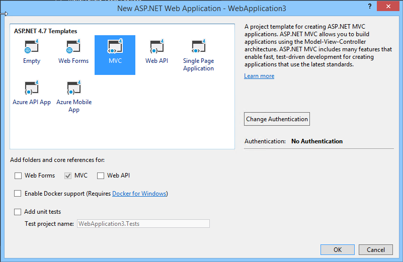
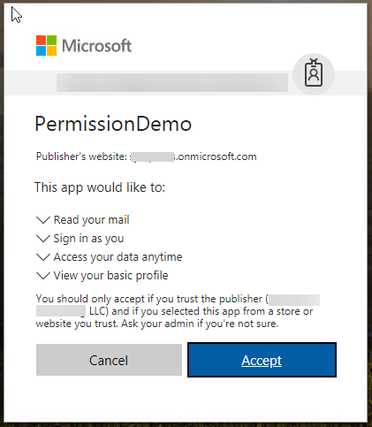

# Lab: Building Microsoft Graph Applications

In this lab, you will walk through authentication and permissions scenarios using the Microsoft Graph Graph SDK and Microsoft Authentication Library (MSAL).

## In this lab

1. [Obtain tokens and connect with the Microsoft Graph using REST](#exercise1)
1. [Connecting with Microsoft Graph using OpenID Connect](#exercise2)
1. [Dynamic permissions with the Azure AD v2.0 endpoint and Microsoft Graph](#exercise3)

## Prerequisites

This lab uses **PowerShell ISE** and **Visual Studio 2017**. It also requires an **Azure Active Directory** directory and a user who can log in with administrative privileges as well as a directory user who does not have administrative privileges.

## Setup

Open the **Visual Studio 2017** installer and enable the **.NET desktop development**, **Mobile applications with .NET**, **Azure development**,and **Universal Windows Platform** features. Make sure to update Visual Studio 2017 to the latest version, and update VSIX packages (Tools > Extensions and Updates).

<a name="exercise1"></a>

## Exercise 1: Obtain tokens and connect with the Microsoft Graph using REST

This lab will walk you through connecting to the Azure AD v2.0 endpoints to authorize the application, obtain a token and connect with Microsoft Graph.

### Register the application

1. Visit the [Application Registration Portal](https://apps.dev.microsoft.com/) to register the application.

1. Once the application is created, an app ID is provided on the screen. Copy this app ID as you will use it as the Client ID.

1. Add a new app secret by selecting the **Generate new password** button and copy the app secret to use later as the client secret.

1. Select the **Add Platform** button. In the dialog box, choose **Web Application**. Change the Redirect URL to **http://localhost:8089**. Select **Save**.

    

1. Open **Visual Studio 2017** and create a new **ASP.NET Web Application (.NET Framework)**.

    

1. Choose **MVC**.

    

1. Copy the URL of the MVC app for use in the following script. Start the debugger.

    

1. Open a new **PowerShell ISE** window. Copy the following code and paste in the script pane. Replace `[YOUR WEB APP URL]` in the third to last line with the URL of the web application you created in the previous step.

    ```powershell
    function Get-CurrentUserProfile
    {
        Param
        (
            [parameter(Mandatory=$true,
            ValueFromPipeline=$true)]
            [PSCredential]
            $credential,
            [parameter(Mandatory=$true)]
            [string]
            $scopes,
            [parameter(Mandatory=$true)]
            [string]
            $redirecUrl,
            [switch]
            $displayTokens
        )

        $clientID = $credential.Username
        $clientSecret = $credential.GetNetworkCredential().Password

        #v2.0 authorize URL
        $authorizeUrl = "https://login.microsoftonline.com/common/oauth2/v2.0/authorize"

        #Permission scopes
        $requestUrl = $authorizeUrl + "?scope=$scopes"

        #Code grant, will receive a code that can be redeemed for a token
        $requestUrl += "&response_type=code"

        #Add your app's Application ID
        $requestUrl += "&client_id=$clientID"

        #Add your app's redirect URL
        $requestUrl += "&redirect_uri=$redirecUrl"

        #Options for response_mode are "query" or "form_post". We want the response
        #to include the data in the querystring
        $requestUrl += "&response_mode=query"

        Write-Host
        Write-Host "Copy the following URL and paste the following into your browser:"
        Write-Host
        Write-Host $requestUrl -ForegroundColor Cyan
        Write-Host
        Write-Host "Copy the code querystring value from the browser and paste it below."
        Write-Host
        $code = Read-Host -Prompt "Enter the code"

        $body = "client_id=$clientID&client_secret=$clientSecret&scope=$scopes&grant_type=authorization_code&code=$code&redirect_uri=$redirecUrl"
        #v2.0 token URL
        $tokenUrl = "https://login.microsoftonline.com/common/oauth2/v2.0/token"

        $response = Invoke-RestMethod -Method Post -Uri $tokenUrl -Headers @{"Content-Type" = "application/x-www-form-urlencoded"} -Body $body

        if($displayTokens)
        {
            $response | select * | fl
        }

        #Pass the access_token in the Authorization header to the Microsoft Graph
        $token = $response.access_token
        Invoke-RestMethod -Method Get -Uri "https://graph.microsoft.com/v1.0/me" -Headers @{"Authorization" = "bearer $token"}
    }

    #offline_acess:  Allows requesting refresh tokens
    #openid:  Allows your app to sign the user in and receive an app-specific identifier for the user
    #profile: Allows your app access to all other basic information such as name, preferred username, object ID, and others
    #User.Read: Allows your app to read the current's user's profile
    $scopes = "offline_access+openid+profile+User.Read"

    #Redirects to this URL will show a 404 in your browser, but allows you to copy the returned code from the URL bar
    #Must match a redirect URL for your registered application
    $redirectURL = "[YOUR WEB APP URL]"

    $credential = Get-Credential -Message "Enter the client ID and client secret"
    Get-CurrentUserProfile $credential -scopes $scopes -redirecUrl $redirectURL -displayTokens
    ```

    >Note:  This script will first create an URL to the authorize endpoint, providing the client ID, permission scopes, and redirect URL. If you attempted to use Invoke-RestMethod to this endpoint, the result would be the HTML content of the resulting login screen. You need to log in and authorize the application, so you will copy the URL to a browser.

1. Run the PowerShell script. You are prompted to enter a username and password. The username is the app ID generated when you registered the application. The password is the app secret that was generated.

    

1. Copy the resulting URL.

    

1. Paste the URL in a browser and sign in when prompted. After you sign in an authorize the application, the browser is redirected to the MVC app you have running, the URL contains the code needed.

    

1. Copy the code value from the `querystring` in the browser's URL bar, up to the trailing `&session_state` querystring value.

    

1. Paste the code value into the PowerShell window. The result is a successful call to Microsoft Graph, getting the profile of the currently signed-in user.

    

    

    >Note:  The output includes three tokens: an ID token, an access token, and a refresh token. These tokens are JWT tokens that, as of the time of this writing, can be decoded and their contents inspected. These tokens are currently not encrypted but that is subject to change.

1. Copy the `access_token` value in the output.

    

1. Open a browser and go to **https://jwt.calebb.net**.

1. Paste the encoded token to inspect its contents.

    

<a name="exercise2"></a>

## Exercise 2: Connecting with Microsoft Graph using OpenID Connect

This exercise will walk you through creating a web application that connects with Microsoft Graph using OpenID Connect.

### Requirements

- Visual Studio 2017
- A personal Microsoft Account with access to an Outlook.com enabled mailbox
- A work or school account with access to an Office 365 enabled mailbox

### Register the application

1. Visit the [Application Registration Portal](https://apps.dev.microsoft.com/) to register the application.

1. Once the application is created, an app ID is provided on the screen. Copy this app ID, you will use it as the Client ID.

1. Add a new app secret by selecting the **Generate new password** button and copy the app secret to use later as the client secret.

1. Select the **Add Platform** button. A dialog box is presented, choose **Web Application**.

1. Change the Redirect URL to **https://localhost:44326/** and select **Save** to save all changes.

    

1. From your shell or command line, paste the following:

    ```shell
    git clone https://github.com/Azure-Samples/active-directory-dotnet-webapp-openidconnect-v2.git
    ```

1. Open the solution using **Visual Studio 2017**. Restore the missing NuGet packages and reload the solution.

1. Verify that the `Scope` variable in your code is equal to `openid email profile offline_access Mail.Read`. Change it if needed.

    >Note:  Edit the **web.config** file with your app's coordinates. Find the appSettings key `ida:ClientId` and provide the app ID from your app registration. Find the appSettings key `ida:ClientSecret` and provide the value from the app secret generated in the previous step.

### Inspect the code sample

1. Open the **App_Start/Startup.Auth.cs** file. This is where authentication begins using the OWIN middleware.

    ```csharp
    app.UseOpenIdConnectAuthentication(
        new OpenIdConnectAuthenticationOptions
        {
            // The `Authority` represents the v2.0 endpoint - https://login.microsoftonline.com/common/v2.0
            // The `Scope` describes the initial permissions that your app will need.  See https://azure.microsoft.com/documentation/articles/active-directory-v2-scopes/

            ClientId = clientId,
            Authority = String.Format(CultureInfo.InvariantCulture, aadInstance, "common", "/v2.0"),
            RedirectUri = redirectUri,
            Scope = "openid email profile offline_access Mail.Read",
            PostLogoutRedirectUri = redirectUri,
            TokenValidationParameters = new TokenValidationParameters
            {
                ValidateIssuer = false,
                // In a real application you would use IssuerValidator for additional checks, like making sure the user's organization has signed up for your app.
                //     IssuerValidator = (issuer, token, tvp) =>
                //     {
                //        //if(MyCustomTenantValidation(issuer))
                //        return issuer;
                //        //else
                //        //    throw new SecurityTokenInvalidIssuerException("Invalid issuer");
                //    },
            },
    ```

    >Note:  When an authorization code is received, the code is redeemed for an access token and a refresh token which are stored in cache.

    ```csharp
    Notifications = new OpenIdConnectAuthenticationNotifications
    {
        // If there is a code in the OpenID Connect response, redeem it for an access token and refresh token, and store those away.
        AuthorizationCodeReceived = async (context) =>
        {
            var code = context.Code;
            string signedInUserID = context.AuthenticationTicket.Identity.FindFirst(ClaimTypes.NameIdentifier).Value;
            TokenCache userTokenCache = new MSALSessionCache(signedInUserID,
                context.OwinContext.Environment["System.Web.HttpContextBase"] as HttpContextBase).GetMsalCacheInstance();
            ConfidentialClientApplication cca =
                new ConfidentialClientApplication(clientId, redirectUri, new ClientCredential(appKey), userTokenCache,null);
            string[] scopes = { "Mail.Read" };
            try
            {
                AuthenticationResult result = await cca.AcquireTokenByAuthorizationCodeAsync(code, scopes);
            }
            catch (Exception eee)
            {

            }
        },
        AuthenticationFailed = (notification) =>
        {
            notification.HandleResponse();
            notification.Response.Redirect("/Error?message=" + notification.Exception.Message);
            return Task.FromResult(0);
        }
    }
    ```

1. Open the **Models/MsalSessionCache.cs** file. Notice that the token is persisted in session state. In case of a load-balanced application, such as an Azure Web App with multiple instances, you may need to centrally persist the state to avoid forcing the user to log on multiple times.

    ```csharp
    public void Load()
    {
        SessionLock.EnterReadLock();
        cache.Deserialize((byte[])httpContext.Session[CacheId]);
        SessionLock.ExitReadLock();
    }

    public void Persist()
    {
        SessionLock.EnterWriteLock();

        // Optimistically set HasStateChanged to false. We need to do it early to avoid losing changes made by a concurrent thread.
        cache.HasStateChanged = false;

        // Reflect changes in the persistent store
        httpContext.Session[CacheId] = cache.Serialize();
        SessionLock.ExitWriteLock();
    }
    ```

1. Open the **Controllers/HomeController.cs** file and view the **About** controller method. The **Authorize** attribute ensures that only authenticated users can exercise this code. The **About** method contains code to retrieve the current user's claims and makes them available via the `ViewBag` for display by the view. The Azure AD v2.0 endpoint returns an `id_token` back to the application which contains these claims. The data backing these claims is present because the **OpenID Connect** scopes **openid** and **profile** were requested.

    ```csharp
    [Authorize]
    public async Task<ActionResult> About()
    {
        ViewBag.Name = ClaimsPrincipal.Current.FindFirst("name").Value;
        ViewBag.AuthorizationRequest = string.Empty;
        // The object ID claim will only be emitted for work or school accounts at this time.
        Claim oid = ClaimsPrincipal.Current.FindFirst("http://schemas.microsoft.com/identity/claims/objectidentifier");
        ViewBag.ObjectId = oid == null ? string.Empty : oid.Value;

        // The 'preferred_username' claim can be used for showing the user's primary way of identifying themselves
        ViewBag.Username = ClaimsPrincipal.Current.FindFirst("preferred_username").Value;

        // The subject or nameidentifier claim can be used to uniquely identify the user
        ViewBag.Subject = ClaimsPrincipal.Current.FindFirst("http://schemas.xmlsoap.org/ws/2005/05/identity/claims/nameidentifier").Value;
        return View();
    }
    ```

1. Open the **Controllers/HomeController.cs** file and view the **ReadMail** controller method. Unlike the **About** method, this method is not decorated with the `Authorize` attribute. The method retrieves the current user's token cache and creates a new `ConfidentialClientApplication` using the user's token cache. If there are users in the cache, the code calls `AcquireTokenSilentAsync` which will look in the cache for a token matching the user and the requested scope. If one is not present, it will attempt to use the refresh token. It then attaches the token to the request to Microsoft Graph to retrieve the user's messages.

    ```csharp
    public async Task<ActionResult> ReadMail()
    {
        try
        {
            string signedInUserID = ClaimsPrincipal.Current.FindFirst(ClaimTypes.NameIdentifier).Value;
            TokenCache userTokenCache = new MSALSessionCache(signedInUserID, this.HttpContext).GetMsalCacheInstance();

            ConfidentialClientApplication cca =
                new ConfidentialClientApplication(clientId, redirectUri, new ClientCredential(appKey), userTokenCache, null);
            if (cca.Users.Count() > 0)
            {
                string[] scopes = { "Mail.Read" };
                AuthenticationResult result = await cca.AcquireTokenSilentAsync(scopes, cca.Users.First());

                HttpClient hc = new HttpClient();
                hc.DefaultRequestHeaders.Authorization =
                    new System.Net.Http.Headers.AuthenticationHeaderValue("bearer", result.AccessToken);
                HttpResponseMessage hrm = await hc.GetAsync("https://graph.microsoft.com/v1.0/me/messages");
                string rez = await hrm.Content.ReadAsStringAsync();
                ViewBag.Message = rez;
            }
            else { }
            return View();
        }
        catch (MsalUiRequiredException)
        {
            ViewBag.Relogin = "true";
            return View();
        }
        catch (Exception eee)
        {
            ViewBag.Error = "An error has occurred. Details: " + eee.Message;
            return View();
        }
    }
    ```

### Run the application

1. Run the application. Selecting either **About** or the sign in link in the top right will prompt you to sign in.

    

    

1. After signing in, you are prompted for consent.

    

1. After consenting, select the **About** link. Information is displayed from your current set of claims in the OpenID Connect flow.

    

1. Since you are now logged in, the **Read Mail** link is now visible. Select the **Read Mail** link. You can now read email messages from your inbox.

<a name="exercise3"></a>

## Exercise 3: Dynamic permissions with the Azure AD v2.0 endpoint and Microsoft Graph

This exercise will walk you through creating a web application that connects with Microsoft Graph using OpenID Connect and requests additional permissions.

### Register the application

**Note:** You can reuse the same application registration from the previous lab, [Connecting with Microsoft Graph using OpenID Connect](#exercise2). If you have already completed the app registration, move to the next section.

1. If you are not reusing your previously created application registration, visit the [Application Registration Portal](https://apps.dev.microsoft.com/) to register the application.

1. Once the application is created, an app ID is provided on the screen. Copy this ID, you will use it as the Client ID.

1. Add a new app secret by selecting the **Generate new password** button and copy the secret to use later as the Client Secret.

1. Select the **Add Platform** button. A dialog box is presented, choose **Web Application**. Change the Redirect URL to **https://localhost:44326/**. Select **Save** to save all changes.

    

1. From your shell or command line:

    ```shell
    git clone https://github.com/Azure-Samples/active-directory-dotnet-webapp-openidconnect-v2.git
    ```

1. Open the solution using **Visual Studio 2017**. Restore the missing **NuGet** packages and reload the solution.

1. Edit the **web.config** file with your app's coordinates. Find the appSettings key `ida:ClientId` and provide the app ID from your app registration. Find the appSettings key `ida:ClientSecret` and provide the value from the app secret generated in the previous step.

### Inspect the code sample

1. Open the **App_Start/Startup.Auth.cs** file. This is where authentication begins using the OWIN middleware.

1. Verify that the `Scope` variable in your code is equal to `openid email profile offline_access Mail.Read`. Update it if necessary.

    ```csharp
    app.UseOpenIdConnectAuthentication(
        new OpenIdConnectAuthenticationOptions
        {
            // The `Authority` represents the v2.0 endpoint - https://login.microsoftonline.com/common/v2.0
            // The `Scope` describes the initial permissions that your app will need.  See https://azure.microsoft.com/documentation/articles/active-directory-v2-scopes/

            ClientId = clientId,
            Authority = String.Format(CultureInfo.InvariantCulture, aadInstance, "common", "/v2.0"),
            RedirectUri = redirectUri,
            Scope = "openid email profile offline_access Mail.Read",
            PostLogoutRedirectUri = redirectUri,
            TokenValidationParameters = new TokenValidationParameters
            {
                ValidateIssuer = false,
                // In a real application you would use IssuerValidator for additional checks, like making sure the user's organization has signed up for your app.
                //     IssuerValidator = (issuer, token, tvp) =>
                //     {
                //        //if(MyCustomTenantValidation(issuer))
                //        return issuer;
                //        //else
                //        //    throw new SecurityTokenInvalidIssuerException("Invalid issuer");
                //    },
            },
    ```

1. When an authorization code is received, the code is redeemed for an access token and a refresh token, which are stored in cache. Notice the scope that is requested, `Mail.Read`. The token that is received is only valid for reading emails. If the application attempts to send an email, it would fail because the app has not been granted consent.

    ```csharp
    Notifications = new OpenIdConnectAuthenticationNotifications
    {
        // If there is a code in the OpenID Connect response, redeem it for an access token and refresh token, and store those away.
        AuthorizationCodeReceived = async (context) =>
        {
            var code = context.Code;
            string signedInUserID = context.AuthenticationTicket.Identity.FindFirst(ClaimTypes.NameIdentifier).Value;
            TokenCache userTokenCache = new MSALSessionCache(signedInUserID,
                context.OwinContext.Environment["System.Web.HttpContextBase"] as HttpContextBase).GetMsalCacheInstance();
            ConfidentialClientApplication cca =
                new ConfidentialClientApplication(clientId, redirectUri, new ClientCredential(appKey), userTokenCache,null);
            string[] scopes = { "Mail.Read" };
            try
            {
                AuthenticationResult result = await cca.AcquireTokenByAuthorizationCodeAsync(code, scopes);
            }
            catch (Exception eee)
            {

            }
        },
        AuthenticationFailed = (notification) =>
        {
            notification.HandleResponse();
            notification.Response.Redirect("/Error?message=" + notification.Exception.Message);
            return Task.FromResult(0);
        }
    }
    ```

1. Open the **Controllers/HomeController.cs** file. Scroll down to the `SendMail` method with no parameters. When an HTTP GET is issued to this page, it will create a token cache and create a new `ConfidentialClientApplication` using the app secret. It then calls `AcquireTokenSilentAsync` using the `Mail.Send` scope. This scope was not requested when the app started, the user will not have already consented.  The MSAL code will look in the cache for a token matching the scope, then attempt using the refresh token, and finally will fail if the user has not consented.

    ```csharp
    [Authorize]
    public async Task<ActionResult> SendMail()
    {
        // try to get token silently
        string signedInUserID = ClaimsPrincipal.Current.FindFirst(ClaimTypes.NameIdentifier).Value;
        TokenCache userTokenCache = new MSALSessionCache(signedInUserID, this.HttpContext).GetMsalCacheInstance();
        ConfidentialClientApplication cca = new ConfidentialClientApplication(clientId, redirectUri,new ClientCredential(appKey), userTokenCache, null);
        if (cca.Users.Count() > 0)
        {
            string[] scopes = { "Mail.Send" };
            try
            {
                AuthenticationResult result = await cca.AcquireTokenSilentAsync(scopes,cca.Users.First());
            }
            catch (MsalUiRequiredException)
            {
                try
                {// when failing, manufacture the URL and assign it
                    string authReqUrl = await WebApp.Utils.OAuth2RequestManager.GenerateAuthorizationRequestUrl(scopes, cca, this.HttpContext, Url);
                    ViewBag.AuthorizationRequest = authReqUrl;
                }
                catch (Exception ee)
                {

                }
            }
        }
        else
        {

        }
        return View();
    }
    ```

1. Open the **utils/OAuth2CodeRedeemerMiddleware.cs** file and scroll down to the `GenerateAuthorizationRequestUrl` method. This method will generate the request to the authorize endpoint to request additional permissions.

    ```csharp
    public static async Task<string> GenerateAuthorizationRequestUrl(string[] scopes, ConfidentialClientApplication cca, HttpContextBase httpcontext, UrlHelper url)
    {
        string signedInUserID = ClaimsPrincipal.Current.FindFirst(System.IdentityModel.Claims.ClaimTypes.NameIdentifier).Value;
        string preferredUsername = ClaimsPrincipal.Current.FindFirst("preferred_username").Value;
        Uri oauthCodeProcessingPath = new Uri(httpcontext.Request.Url.GetLeftPart(UriPartial.Authority).ToString());
        string state = GenerateState(httpcontext.Request.Url.ToString(), httpcontext, url, scopes);
        string tenantID = ClaimsPrincipal.Current.FindFirst("http://schemas.microsoft.com/identity/claims/tenantid").Value;
        string domain_hint = (tenantID == "9188040d-6c67-4c5b-b112-36a304b66dad") ? "consumers" : "organizations";
        Uri authzMessageUri =
            await cca.GetAuthorizationRequestUrlAsync(
                scopes,
            oauthCodeProcessingPath.ToString(),
            preferredUsername,
            state == null ? null : "&state=" + state + "&domain_hint=" + domain_hint,
            null,
            // TODo change
            cca.Authority
            );
        return authzMessageUri.ToString();

    }
    ```

### Run the application

1. Run the application. Selecting the **About** link or select the **sign in** link in the top right to sign in.

    

    

1. After signing in, if you have not already granted consent, the user is prompted for consent.

    

1. After consenting, select the **About** link. Information  is displayed from your current set of claims in the OpenID Connect flow.

    

1. Since you are now logged in, the **Read Mail** link is now visible. Select the **Read Mail** link. You can now read email messages from your inbox.

    >Note: The app was consented the ability to read mail, but was not consented to send an email on the user's behalf. The MSAL code attempts a call to `AcquireTokenSilentAsync`, which fails because the user did not consent. The application catches the exception and the code builds a URL to the authorize endpoint to request the `Mail.Send` permission. The link looks similar to: `https://login.microsoftonline.com/common/oauth2/v2.0/authorize?scope=Mail.Send+offline_access+openid+profile&response_type=code&client_id=0777388d-640c-4bc3-9053-671d6a8300c4&redirect_uri=https:%2F%2Flocalhost:44326%2F&login_hint=AdeleV%40msgraphdemo.onmicrosoft.com&prompt=select_account&domain_hint=organizations`

    

1. Select the link. You are now prompted to consent. The permissions include "Send mail as you".

    

1. After selecting **Accept**, you are redirected back to the application and the app can now send an email on your behalf.

    