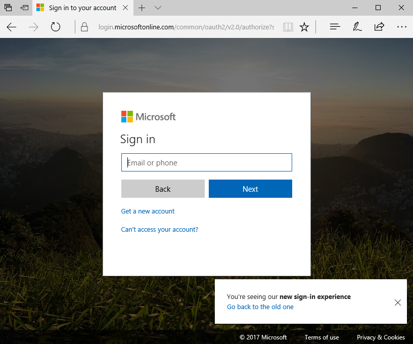

# Lab: Building Microsoft Graph Applications

In this lab, you will walk through authentication and permissions scenarios using the Microsoft Graph Graph SDK and Microsoft Authentication Library (MSAL).

## In this lab

1. [Obtain tokens and connect with the Microsoft Graph using REST](#exercise-1-obtain-tokens-and-connect-with-the-microsoft-graph-using-rest)
1. [Connecting with Microsoft Graph using OpenID Connect](#exercise-2-connecting-with-microsoft-graph-using-openid-connect)
1. [Dynamic permissions with the Azure AD v2.0 endpoint and Microsoft Graph](#exercise-3-dynamic-permissions-with-the-azure-ad-v20-endpoint-and-microsoft-graph)

## Prerequisites

This lab uses **PowerShell ISE** and **Visual Studio 2017**. It also requires an **Azure Active Directory** directory and a user who can log in with administrative privileges as well as a directory user who does not have administrative privileges.

## Setup

Open the **Visual Studio 2017** installer and enable the **.NET desktop development**, **Mobile applications with .NET**, **Azure development**,and **Universal Windows Platform** features. Make sure to update Visual Studio 2017 to the latest version, and update VSIX packages (Tools > Extensions and Updates).

## Exercise 1: Obtain tokens and connect with the Microsoft Graph using REST

This lab will walk you through connecting to the Azure AD v2.0 endpoints to authorize the application, obtain a token and connect with Microsoft Graph.

### Register the application for getting tokens using REST

1. Open a browser and navigate to the [Azure Active Directory admin center](https://aad.portal.azure.com). Login using a **personal account** (aka: Microsoft Account) or **Work or School Account**.

1. Select **Azure Active Directory** in the left-hand navigation, then select **App registrations** under **Manage**.

1. Select **New registration**. On the **Register an application** page, set the values as follows.

    - Set **Name** to `Graph Authentication Test`.
    - Set **Supported account types** to **Accounts in any organizational directory and personal Microsoft accounts**.
    - Under **Redirect URI**, set the first drop-down to `Web` and set the value to `https://localhost:44326`.

1. Choose **Register**. On the **Graph Authentication Test** page, copy the value of the **Application (client) ID** and save it, you will need it in the next step.

1. Select **Certificates & secrets** under **Manage**. Select the **New client secret** button. Set  **Description** to `Never expires`, set **Expires** to `Never` and choose **Add**.

    

1. Copy the client secret value before you leave this page. You will need it in the next step.

    > **Important:** This client secret is never shown again, so make sure you copy it now.

1. Select **Authentication** under **Manage**. Check `ID tokens` under **Implicit grant** in the **Advanced settings** section and choose **Save**. This setting indicates that you want to get an ID token along with the access and refresh tokens. You'll see this later in the exercise.

    

### Create the PowerShell script

1. Open a new **PowerShell ISE** window. Copy the following code and paste in the script pane.

    ```powershell
    function Get-CurrentUserProfile
    {
      Param
      (
        [parameter(Mandatory=$true,
        ValueFromPipeline=$true)]
        [PSCredential]
        $credential,
        [parameter(Mandatory=$true)]
        [string]
        $scopes,
        [parameter(Mandatory=$true)]
        [string]
        $redirectUrl,
        [switch]
        $displayTokens
      )

      $clientID = $credential.Username
      $clientSecret = $credential.GetNetworkCredential().Password
      #URL encode the secret
      $clientSecret = [System.Web.HttpUtility]::UrlEncode($clientSecret)

      #v2.0 authorize URL
      $authorizeUrl = "https://login.microsoftonline.com/common/oauth2/v2.0/authorize"

      #Permission scopes
      $requestUrl = $authorizeUrl + "?scope=$scopes"

      #Code grant, will receive a code that can be redeemed for a token
      $requestUrl += "&response_type=code"

      #Add your app's Application ID
      $requestUrl += "&client_id=$clientID"

      #Add your app's redirect URL
      $requestUrl += "&redirect_uri=$redirectUrl"

      #Options for response_mode are "query" or "form_post". We want the response
      #to include the data in the querystring
      $requestUrl += "&response_mode=query"

      Write-Host
      Write-Host "Copy the following URL and paste the following into your browser:"
      Write-Host
      Write-Host $requestUrl -ForegroundColor Cyan
      Write-Host
      Write-Host "Copy the code querystring value from the browser and paste it below."
      Write-Host
      $code = Read-Host -Prompt "Enter the code"

      $body = "client_id=$clientID&client_secret=$clientSecret&scope=$scopes&grant_type=authorization_code&code=$code&redirect_uri=$redirectUrl"
      #v2.0 token URL
      $tokenUrl = "https://login.microsoftonline.com/common/oauth2/v2.0/token"

      $response = Invoke-RestMethod -Method Post -Uri $tokenUrl -Headers @{"Content-Type" = "application/x-www-form-urlencoded"} -Body $body

      if($displayTokens)
      {
        $response | select * | fl
      }

      #Pass the access_token in the Authorization header to the Microsoft Graph
      $token = $response.access_token
      Invoke-RestMethod -Method Get -Uri "https://graph.microsoft.com/v1.0/me" -Headers @{"Authorization" = "bearer $token"}
    }

    Add-Type -AssemblyName System.Web

    #offline_access:  Allows requesting refresh tokens
    #openid:  Allows your app to sign the user in and receive an app-specific identifier for the user
    #profile: Allows your app access to all other basic information such as name, preferred username, object ID, and others
    #User.Read: Allows your app to read the current's user's profile
    $scopes = "offline_access+openid+profile+User.Read"

    #Redirects to this URL will show a 404 in your browser, but allows you to copy the returned code from the URL bar
    #Must match a redirect URL for your registered application
    $redirectURL = "https://localhost:44326"

    $credential = Get-Credential -Message "Enter the client ID and client secret"
    Get-CurrentUserProfile $credential -scopes $scopes -redirectUrl $redirectURL -displayTokens
    ```

    >Note:  This script will first create an URL to the authorize endpoint, providing the client ID, permission scopes, and redirect URL. If you attempted to use `Invoke-RestMethod` to this endpoint, the result would be the HTML content of the resulting login screen. You need to log in and authorize the application, so you will copy the URL to a browser.

1. Run the PowerShell script. You are prompted to enter a username and password. The username is the application ID and the password is the client secret that you saved in previous steps.

    

1. Copy the resulting URL.

    

1. Paste the URL in a browser and sign in when prompted. After you sign in and authorize the application, the browser will be redirected to the redirect URL we configured earlier (https://localhost:44326). There's nothing listening at that URL but that doesn't matter since all we need now is the value of the code `querystring` parameter.

    

1. Copy the code value from the `querystring` in the browser's URL bar, up to the trailing `&session_state` querystring value.

    

1. Paste the code value into the PowerShell window. The result is a successful call to Microsoft Graph, getting the profile of the currently signed-in user.

    

    

    >Note:  The output includes three tokens: an ID token, an access token, and a refresh token. These tokens are JWT tokens that, as of the time of this writing, can be decoded and their contents inspected. These tokens are currently not encrypted but that is subject to change.

1. Copy the `access_token` value in the output.

    

1. Open a browser and go to **https://jwt.ms**.

1. Paste the encoded token (removing any whitespace) to inspect its contents.

    

## Exercise 2: Connecting with Microsoft Graph using OpenID Connect

This exercise will walk you through creating a web application that connects with Microsoft Graph using OpenID Connect.

### Requirements

- Visual Studio 2017
- A personal Microsoft Account with access to an Outlook.com enabled mailbox
- A work or school account with access to an Office 365 enabled mailbox

### Register the application for OpenID Connect

1. From your shell or command line, paste the following:

    ```shell
    git clone https://github.com/Azure-Samples/active-directory-dotnet-webapp-openidconnect-v2.git
    ```

1. Open the solution using **Visual Studio 2017**. Restore the missing NuGet packages and reload the solution.

1. Edit the **web.config** file. Find the appSettings key `ida:ClientId` and provide the app ID from your app registration. Find the appSettings key `ida:ClientSecret` and provide the value from the app secret.

### Inspect the code sample for OpenID Connect

1. Open the **App_Start/Startup.Auth.cs** file. This is where authentication begins using the OWIN middleware.

1. Verify that the `Scope` variable in your code is equal to `AuthenticationConfig.BasicSignInScopes + " email Mail.Read"`. Change it if needed. `AuthenticationConfig.BasicSignInScopes` has been set to `openid profile offline_access` elsewhere in the application so the scopes you will be requesting are `openid profile offline_access email Mail.Read`.

    ```csharp
    app.UseOpenIdConnectAuthentication(
        new OpenIdConnectAuthenticationOptions
        {
            // The `Authority` represents the v2.0 endpoint - https://login.microsoftonline.com/common/v2.0
            Authority = AuthenticationConfig.Authority,
            ClientId = AuthenticationConfig.ClientId,
            RedirectUri = AuthenticationConfig.RedirectUri,
            PostLogoutRedirectUri = AuthenticationConfig.RedirectUri,
            Scope = AuthenticationConfig.BasicSignInScopes + " email Mail.Read", // a basic set of permissions for user sign in & profile access "openid profile offline_access"
            TokenValidationParameters = new TokenValidationParameters
            {
                ValidateIssuer = false,
                // In a real application you would use IssuerValidator for additional checks, like making sure the user's organization has signed up for your app.
                //     IssuerValidator = (issuer, token, tvp) =>
                //     {
                //        //if(MyCustomTenantValidation(issuer))
                //        return issuer;
                //        //else
                //        //    throw new SecurityTokenInvalidIssuerException("Invalid issuer");
                //    },
                //NameClaimType = "name",
            },
    ```

    >Note:  When an authorization code is received, the code is redeemed for an access token and a refresh token which are stored in cache.

    ```csharp
                Notifications = new OpenIdConnectAuthenticationNotifications()
                {
                    AuthorizationCodeReceived = OnAuthorizationCodeReceived,
                    AuthenticationFailed = OnAuthenticationFailed,
                }
            });
    }

    private async Task OnAuthorizationCodeReceived(AuthorizationCodeReceivedNotification context)
    {
        // Upon successful sign in, get the access token & cache it using MSAL
        IConfidentialClientApplication clientApp = MsalAppBuilder.BuildConfidentialClientApplication(new ClaimsPrincipal(context.AuthenticationTicket.Identity));
        AuthenticationResult result = await clientApp.AcquireTokenByAuthorizationCode(new[] { "Mail.Read" }, context.Code).ExecuteAsync();
    }
    ```

    ```csharp
    public static IConfidentialClientApplication BuildConfidentialClientApplication()
    {
        return BuildConfidentialClientApplication(ClaimsPrincipal.Current);
    }

    public static IConfidentialClientApplication BuildConfidentialClientApplication(ClaimsPrincipal currentUser)
    {
        IConfidentialClientApplication clientapp = ConfidentialClientApplicationBuilder.Create(AuthenticationConfig.ClientId)
              .WithClientSecret(AuthenticationConfig.ClientSecret)
              .WithRedirectUri(AuthenticationConfig.RedirectUri)
              .WithAuthority(new Uri(AuthenticationConfig.Authority))
              .Build();

        // After the ConfidentialClientApplication is created, we overwrite its default UserTokenCache with our implementation
        MSALPerUserMemoryTokenCache userTokenCache = new MSALPerUserMemoryTokenCache(clientapp.UserTokenCache, currentUser ?? ClaimsPrincipal.Current);

        return clientapp;
    }
    ```

1. Open the **Utils/MSALPerUserMemoryTokenCache.cs** file. Notice that the token is persisted in a `MemoryCache`. In case of a load-balanced application, such as an Azure Web App with multiple instances, you may need to centrally persist the state to avoid forcing the user to log on multiple times.

    ```csharp
    /// <summary>
    /// Loads the user token cache from memory.
    /// </summary>
    private void LoadUserTokenCacheFromMemory()
    {
        string cacheKey = GetMsalAccountId();

        if (string.IsNullOrWhiteSpace(cacheKey))
            return;

        // Ideally, methods that load and persist should be thread safe. MemoryCache.Get() is thread safe.
        byte[] tokenCacheBytes = (byte[])memoryCache.Get(GetMsalAccountId());
        UserTokenCache.DeserializeMsalV3(tokenCacheBytes);
    }

    /// <summary>
    /// Persists the user token blob to the memoryCache.
    /// </summary>
    private void PersistUserTokenCache()
    {
        string cacheKey = GetMsalAccountId();

        if (string.IsNullOrWhiteSpace(cacheKey))
            return;

        // Ideally, methods that load and persist should be thread safe.MemoryCache.Get() is thread safe.
        memoryCache.Set(GetMsalAccountId(), UserTokenCache.SerializeMsalV3(), cacheDuration);
    }
    ```

1. Open the **Controllers/HomeController.cs** file and view the **About** controller method. The **Authorize** attribute ensures that only authenticated users can exercise this code. The **About** method contains code to retrieve the current user's claims and makes them available via the `ViewBag` for display by the view. The Azure AD v2.0 endpoint returns an `id_token` back to the application which contains these claims. The data backing these claims is present because the **OpenID Connect** scopes **openid** and **profile** were requested.

    ```csharp
    [Authorize]
    public async Task<ActionResult> About()
    {
      ViewBag.Name = ClaimsPrincipal.Current.FindFirst("name").Value;
      ViewBag.AuthorizationRequest = string.Empty;
      // The object ID claim will only be emitted for work or school accounts at this time.
      Claim oid = ClaimsPrincipal.Current.FindFirst("http://schemas.microsoft.com/identity/claims/objectidentifier");
      ViewBag.ObjectId = oid == null ? string.Empty : oid.Value;

      // The 'preferred_username' claim can be used for showing the user's primary way of identifying themselves
      ViewBag.Username = ClaimsPrincipal.Current.FindFirst("preferred_username").Value;

      // The subject or nameidentifier claim can be used to uniquely identify the user
      ViewBag.Subject = ClaimsPrincipal.Current.FindFirst("http://schemas.xmlsoap.org/ws/2005/05/identity/claims/nameidentifier").Value;
      return View();
    }
    ```

1. Open the **Controllers/HomeController.cs** file and view the **ReadMail** controller method. Unlike the **About** method, this method is not decorated with the `Authorize` attribute. The method uses the `BuildConfidentialClientApplication` helper method (shown earlier) to construct an object that implements  `IConfidentialClientApplication`. The method then calls `AcquireTokenSilent` which will look in the cache for a token matching the user and the requested scope. If one is not present, it will attempt to use the refresh token. It then attaches the token to the request to Microsoft Graph to retrieve the user's messages.

    ```csharp
    public async Task<ActionResult> ReadMail()
    {
        IConfidentialClientApplication app = MsalAppBuilder.BuildConfidentialClientApplication();
        AuthenticationResult result = null;
        var accounts = await app.GetAccountsAsync();
        string[] scopes = { "Mail.Read" };

        try
        {
            // try to get token silently
            result = await app.AcquireTokenSilent(scopes, accounts.FirstOrDefault()).ExecuteAsync().ConfigureAwait(false);
        }
        catch (MsalUiRequiredException)
        {
            ViewBag.Relogin = "true";
            return View();
        }
        catch (Exception eee)
        {
            ViewBag.Error = "An error has occurred. Details: " + eee.Message;
            return View();
        }

        if (result != null)
        {
            // Use the token to read email
            HttpClient hc = new HttpClient();
            hc.DefaultRequestHeaders.Authorization = new AuthenticationHeaderValue("bearer", result.AccessToken);
            HttpResponseMessage hrm = await hc.GetAsync("https://graph.microsoft.com/v1.0/me/messages");

            string rez = await hrm.Content.ReadAsStringAsync();
            ViewBag.Message = rez;
        }

        return View();
    }
    ```

### Run the application for OpenID Connect

1. Run the application, verifying it's running **https://localhost:44326** which you entered as your Redirect URL in your app registration. Selecting the sign in link in the top right will prompt you to sign in.

    

    

1. After signing in, you are prompted for consent.

    

1. After consenting, select the **About** link. Information is displayed from your current set of claims in the OpenID Connect flow.

    

1. Since you are now logged in, the **Read Mail** link is now visible. Select the **Read Mail** link. You can now read email messages from your inbox.

## Exercise 3: Dynamic permissions with the Azure AD v2.0 endpoint and Microsoft Graph

This exercise will walk you through creating a web application that connects with Microsoft Graph using OpenID Connect and requests additional permissions.

> **Note:** This exercise continues with the same project you used in Exercise #2.

### Inspect the code sample for Dynamic permissions

1. Open the **App_Start/Startup.Auth.cs** file. This is where authentication begins using the OWIN middleware.

1. Verify that the `Scope` variable in your code is equal to `AuthenticationConfig.BasicSignInScopes + " email Mail.Read"`. Change it if needed. `AuthenticationConfig.BasicSignInScopes` has been set to `openid profile offline_access` elsewhere in the application so the scopes you will be requesting are `openid profile offline_access email Mail.Read`.

    ```csharp
    app.UseOpenIdConnectAuthentication(
        new OpenIdConnectAuthenticationOptions
        {
            // The `Authority` represents the v2.0 endpoint - https://login.microsoftonline.com/common/v2.0
            Authority = AuthenticationConfig.Authority,
            ClientId = AuthenticationConfig.ClientId,
            RedirectUri = AuthenticationConfig.RedirectUri,
            PostLogoutRedirectUri = AuthenticationConfig.RedirectUri,
            Scope = AuthenticationConfig.BasicSignInScopes + " email Mail.Read", // a basic set of permissions for user sign in & profile access "openid profile offline_access"
            TokenValidationParameters = new TokenValidationParameters
            {
                ValidateIssuer = false,
                // In a real application you would use IssuerValidator for additional checks, like making sure the user's organization has signed up for your app.
                //     IssuerValidator = (issuer, token, tvp) =>
                //     {
                //        //if(MyCustomTenantValidation(issuer))
                //        return issuer;
                //        //else
                //        //    throw new SecurityTokenInvalidIssuerException("Invalid issuer");
                //    },
                //NameClaimType = "name",
            },
    ```

1. When an authorization code is received, the code is redeemed for an access token and a refresh token, which are stored in cache. Notice the scope that is requested, `Mail.Read`. The token that is received is only valid for reading emails. If the application attempts to send an email, it would fail because the app has not been granted consent.

    ```csharp
                Notifications = new OpenIdConnectAuthenticationNotifications()
                {
                    AuthorizationCodeReceived = OnAuthorizationCodeReceived,
                    AuthenticationFailed = OnAuthenticationFailed,
                }
            });
    }

    private async Task OnAuthorizationCodeReceived(AuthorizationCodeReceivedNotification context)
    {
        // Upon successful sign in, get the access token & cache it using MSAL
        IConfidentialClientApplication clientApp = MsalAppBuilder.BuildConfidentialClientApplication(new ClaimsPrincipal(context.AuthenticationTicket.Identity));
        AuthenticationResult result = await clientApp.AcquireTokenByAuthorizationCode(new[] { "Mail.Read" }, context.Code).ExecuteAsync();
    }
    ```

1. Open the **Controllers/HomeController.cs** file. Scroll down to the `SendMail` method with no parameters. When an HTTP GET is issued to this page, it will use the `BuildConfidentialClientApplication` helper method (shown in exercise #2) to get an object that implements `IConfidentialClientApplication`. It then calls `AcquireTokenSilent` using the `Mail.Send` scope. This scope was not requested when the app started so the user will not have already consented.  The MSAL code will look in the cache for a token matching the scope, then attempt using the refresh token, and finally will fail if the user has not consented.

    ```csharp
    [Authorize]
	[HttpGet]
    public async Task<ActionResult> SendMail()
    {
        // Before we render the send email screen, we use the incremental consent to obtain and cache the access token with the correct scopes
        IConfidentialClientApplication app = MsalAppBuilder.BuildConfidentialClientApplication();
        AuthenticationResult result = null;
        var accounts = await app.GetAccountsAsync();
        string[] scopes = { "Mail.Send" };

        try
        {
            // try to get an already cached token
            result = await app.AcquireTokenSilent(scopes, accounts.FirstOrDefault()).ExecuteAsync().ConfigureAwait(false);
        }
        catch (MsalUiRequiredException ex)
        {
            // A MsalUiRequiredException happened on AcquireTokenSilentAsync.
            // This indicates you need to call AcquireTokenAsync to acquire a token
            Debug.WriteLine($"MsalUiRequiredException: {ex.Message}");

            try
            {
                // Build the auth code request Uri
                string authReqUrl = await OAuth2RequestManager.GenerateAuthorizationRequestUrl(scopes, app, this.HttpContext, Url);
                ViewBag.AuthorizationRequest = authReqUrl;
                ViewBag.Relogin = "true";
            }
            catch (MsalException msalex)
            {
                Response.Write($"Error Acquiring Token:{System.Environment.NewLine}{msalex}");
            }
        }
        catch (Exception ex)
        {
            Response.Write($"Error Acquiring Token Silently:{System.Environment.NewLine}{ex}");
        }

        return View();
    }
    ```

1. Open the **Utils/OAuth2CodeRedeemerMiddleware.cs** file and scroll down to the `GenerateAuthorizationRequestUrl` method. This method will generate the request to the authorize endpoint to request additional permissions.

    ```csharp
    public static async Task<string> GenerateAuthorizationRequestUrl(string[] scopes, IConfidentialClientApplication cca, HttpContextBase httpcontext, UrlHelper url)
    {
        string signedInUserID = ClaimsPrincipal.Current.FindFirst(System.IdentityModel.Claims.ClaimTypes.NameIdentifier).Value;
        string preferredUsername = ClaimsPrincipal.Current.FindFirst("preferred_username").Value;
        Uri oauthCodeProcessingPath = new Uri(httpcontext.Request.Url.GetLeftPart(UriPartial.Authority).ToString());
        string state = GenerateState(httpcontext.Request.Url.ToString(), httpcontext, url, scopes);
        string tenantID = ClaimsPrincipal.Current.FindFirst("http://schemas.microsoft.com/identity/claims/tenantid").Value;

        string domain_hint = (tenantID == ConsumerTenantId) ? "consumers" : "organizations";

        Uri authzMessageUri = await cca
            .GetAuthorizationRequestUrl(scopes)
            .WithRedirectUri(oauthCodeProcessingPath.ToString())
            .WithLoginHint(preferredUsername)
            .WithExtraQueryParameters(state == null ? null : "&state=" + state + "&domain_hint=" + domain_hint)
            .WithAuthority(cca.Authority)
            .ExecuteAsync(CancellationToken.None)
            .ConfigureAwait(false);

        return authzMessageUri.ToString();
    }
    ```

### Run the application for Dynamic permissions

1. Run the application. Select the **sign in** link in the top right to sign in.

    

    

1. After signing in, if you have not already granted consent, the user is prompted for consent.

    

1. After consenting, select the **About** link. Information  is displayed from your current set of claims in the OpenID Connect flow.

    

1. Since you are now logged in, the **Send Mail** link is now visible. Click the **Send Mail** link.

    >Note: The app was consented the ability to read mail, but was not consented to send an email on the user's behalf. The MSAL code attempts a call to `AcquireTokenSilent`, which fails because the user did not consent. The application catches the exception and the code builds a URL to the authorize endpoint to request the `Mail.Send` permission. The link looks similar to: `https://login.microsoftonline.com/common/oauth2/v2.0/authorize?scope=Mail.Send+offline_access+openid+profile&response_type=code&client_id=0777388d-640c-4bc3-9053-671d6a8300c4&redirect_uri=https:%2F%2Flocalhost:44326%2F&login_hint=AdeleV%40msgraphdemo.onmicrosoft.com&prompt=select_account&domain_hint=organizations`

    

    

1. After selecting **Accept**, you are redirected back to the application and the app can now send an email on your behalf.

    